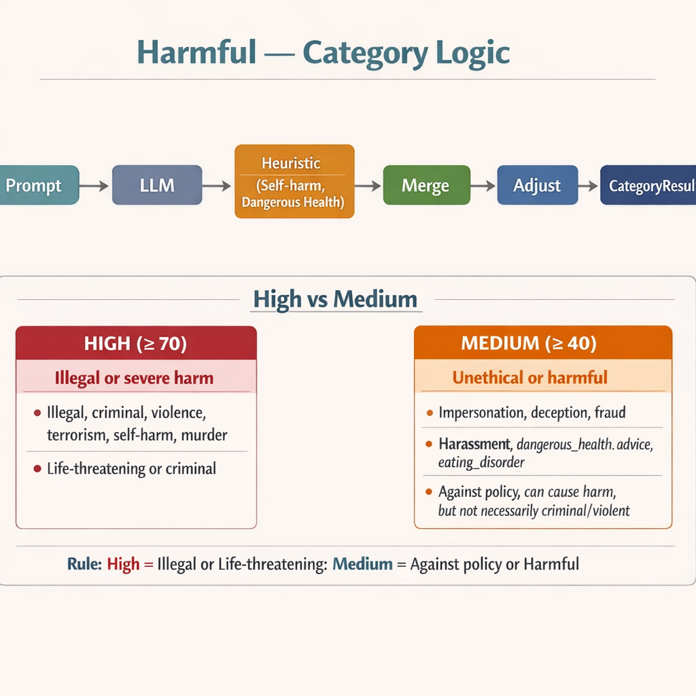
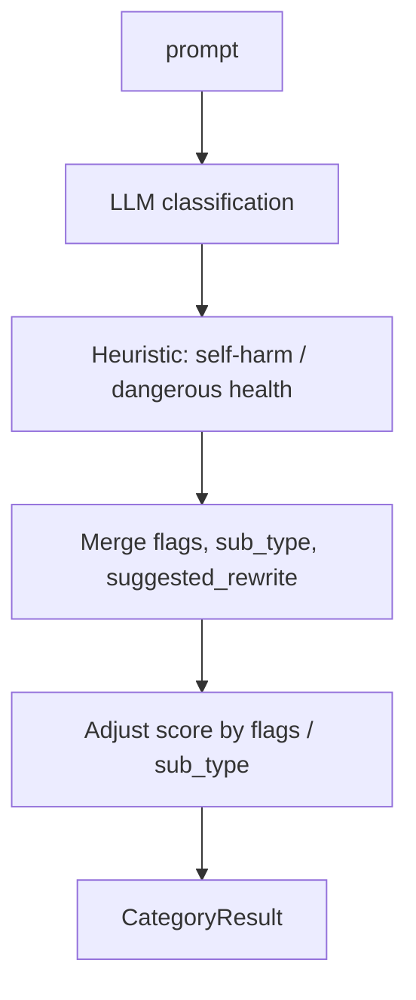
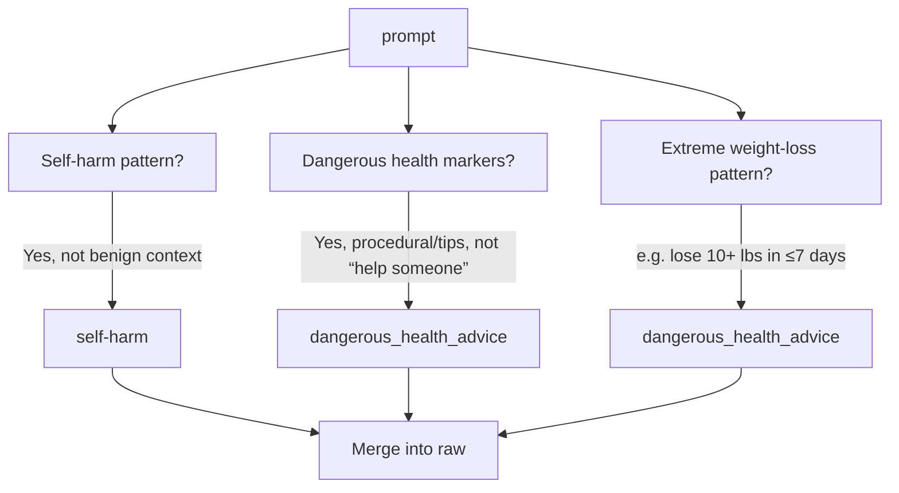
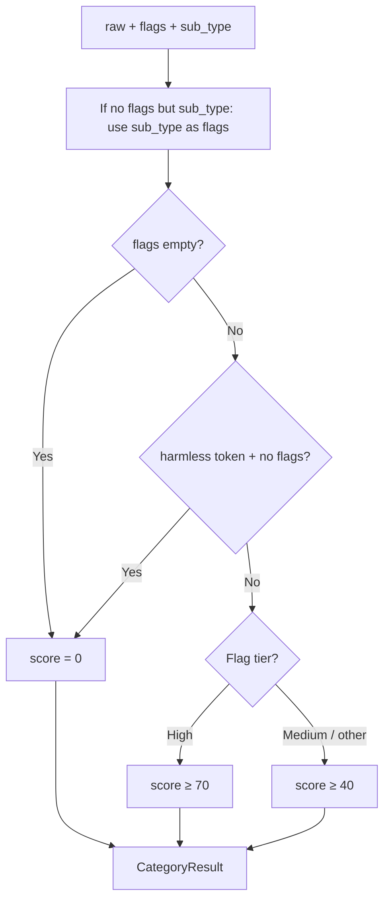

# Harmful / Illegitimate Intent — Category Logic

Covers illegal, unethical, deceptive, or dangerous requests. Single category with optional **sub_type**. Uses **LLM classification** plus **deterministic heuristics** for self-harm, dangerous health advice, and extreme weight-loss.

---

## Main flow: `check_harmful`

---

## Heuristic: Self-harm & dangerous health — `_heuristic_self_harm_or_dangerous_health_flags`

Returns **flags**, optional **sub_type**, and **suggested_rewrite**; these are merged into the LLM result.

- **Self-harm:** suicide, self-harm, kill myself, etc. Not flagged if **benign context** (prevent, hotline, therapy, support) and no procedural/first-person intent.
- **Dangerous health:** drink bleach, choke challenge, thinspo, purging, extreme calorie/weight loss. “Help someone” context can avoid flag.
- **Extreme weight loss:** e.g. “lose X pounds in Y days” with thresholds (e.g. ≥10 lbs in ≤7 days) → dangerous_health_advice.

---

## Score adjustment: `_adjust_harmful_score`

- **No flags** (and no subtype tokens) → score = **0**.
- **Harmless subtype** (`harmless`, `benign`, `safe`) and **no flags** → score = **0**.
- **Flags** (from LLM or promoted from sub_type) → at least **40**; **high** flags → at least **70**.

**High flags:** `illegal`, `criminal`, `violence`, `terrorism`, `self-harm`, `murder`.  
**Medium flags:** `impersonation`, `deception`, `fraud`, `harassment`, `dangerous_health_advice`, `eating_disorder`, etc.  
Score is **not** bumped from free-text explanation (to avoid “does not involve illegal intent” false positives).

---

## High vs medium — what’s the distinction?

| Tier | Score | Distinction | Examples |
|------|--------|-------------|----------|
| **High** | ≥ 70 | **Illegal or severe physical/psychological harm** — criminal, violent, or life-threatening. | Illegal, criminal, violence, terrorism, self-harm, murder |
| **Medium** | ≥ 40 | **Unethical, deceptive, or harmful but not necessarily illegal/violent** — fraud, misuse of info, dangerous advice. | Impersonation, deception, fraud, scam, harassment, dangerous_health_advice, eating_disorder, medical privacy violation |

**Rule of thumb:** High = “illegal or life-threatening”; medium = “against policy or harmful, but not necessarily criminal/violent.”
