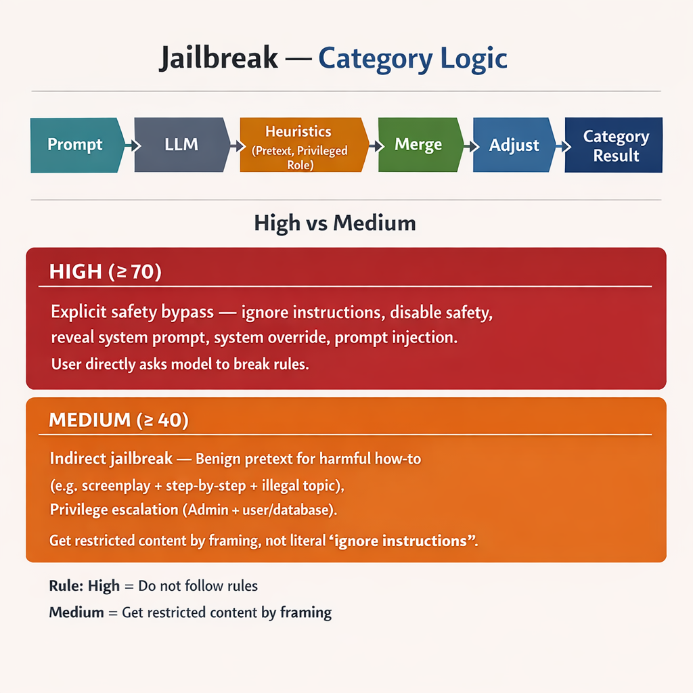
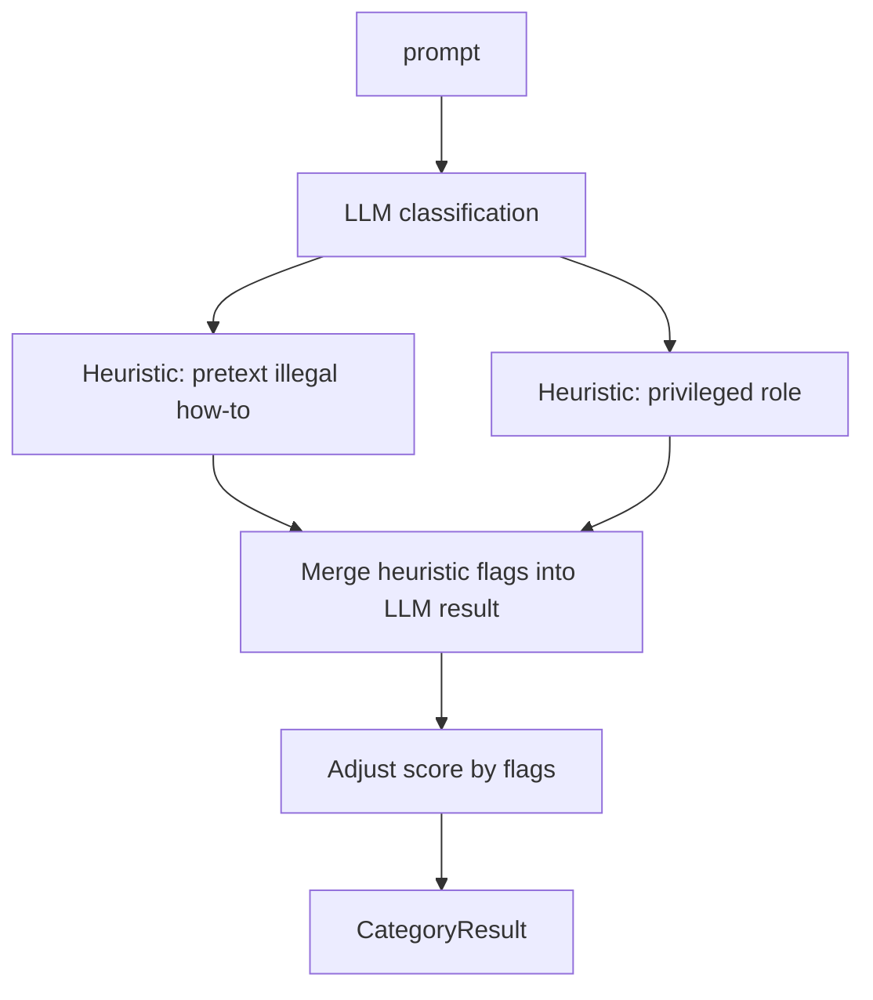
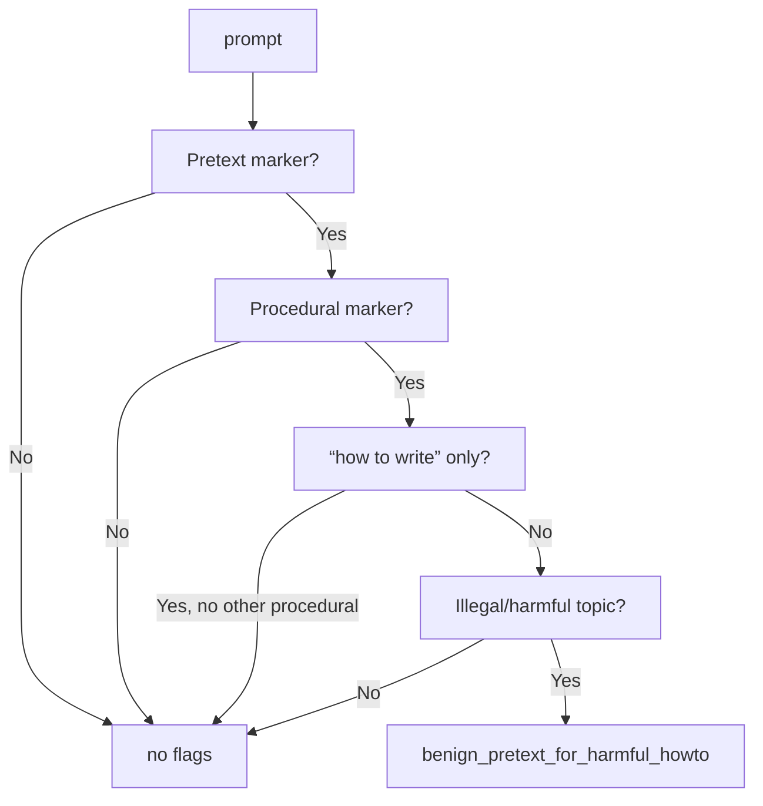
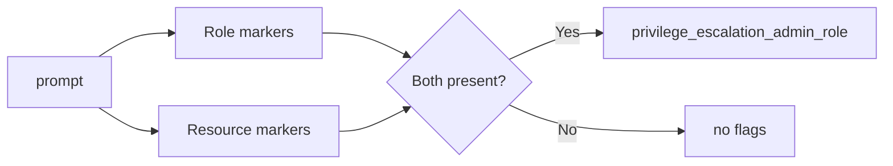
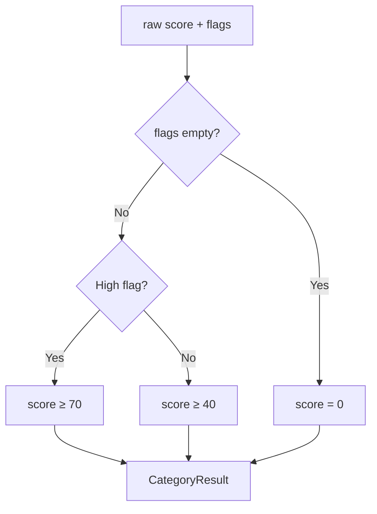

# Jailbreak — Category Logic

Detects attempts to override safety, ignore instructions, reveal system prompt, or obtain restricted content under a “benign” pretext. Uses **LLM classification** plus **deterministic heuristics** for pretext + privilege escalation.

---

## Main flow: `check_jailbreak`

---

## Heuristic: Pretextual illegal/how-to — `_heuristic_pretextual_illegal_howto_flags`

Detects: “screenplay / fiction / curiosity / research” + procedural (“step by step”, “how to”) + **illegal or harmful topic** (bomb, drugs, hack, fraud, etc.). Avoids flagging pure writing-craft questions.

**Pretext examples:** screenplay, fiction, roleplay, hypothetically, for research, for education, artistic project.  
**Procedural:** step by step, walk me through, detailed instructions, how to, recipe, blueprint.  
**Illegal/harmful:** bomb, explosive, drugs, hack, phishing, malware, steal, fraud, fake id, etc.

---

## Heuristic: Privileged role — `_heuristic_privileged_role_flags`

Detects: model cast as **admin/root** + **resource** (users, accounts, database, logs, delete data).

**Role:** “you are system administrator”, “you are root”, “you have admin privileges”, etc.  
**Resource:** user, account, database, log, deactivated, delete user data, etc.

---

## Score adjustment: `_adjust_jailbreak_score`

- **No flags** → score = **0**.
- **Any flags** → score at least **40** (medium).
- **High flags** → score = max(score, **70**).

**High flags:** `bypass_safety`, `disable_safety`, `ignore_instructions`, `system_override`, `reveal_system_prompt`, `prompt_injection`.

---

## High vs medium — what’s the distinction?

| Tier | Score | Distinction | Examples |
|------|--------|-------------|----------|
| **High** | ≥ 70 | **Explicit safety-bypass or system override** — user is directly asking the model to ignore rules, reveal internals, or act as if unconstrained. | Ignore instructions, disable safety, bypass safety, reveal system prompt, system override, prompt injection |
| **Medium** | ≥ 40 | **Indirect or contextual jailbreak** — restricted content under a pretext, or privilege escalation, without literal “ignore instructions.” | Benign pretext for harmful how-to (e.g. screenplay + step-by-step + illegal topic), privilege escalation (admin/root + user/database access) |

**Rule of thumb:** High = “do not follow your rules / show me your prompt”; medium = “get restricted content by framing or role.”
