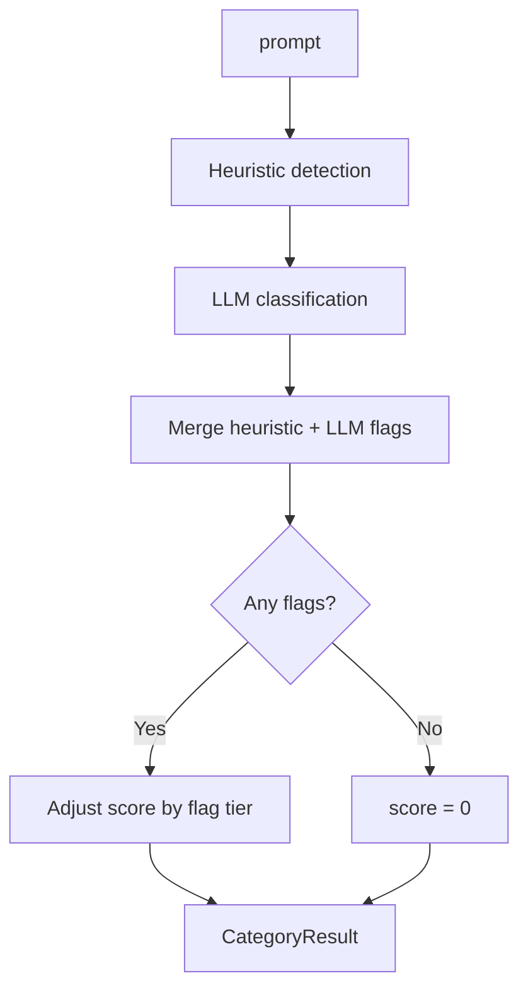
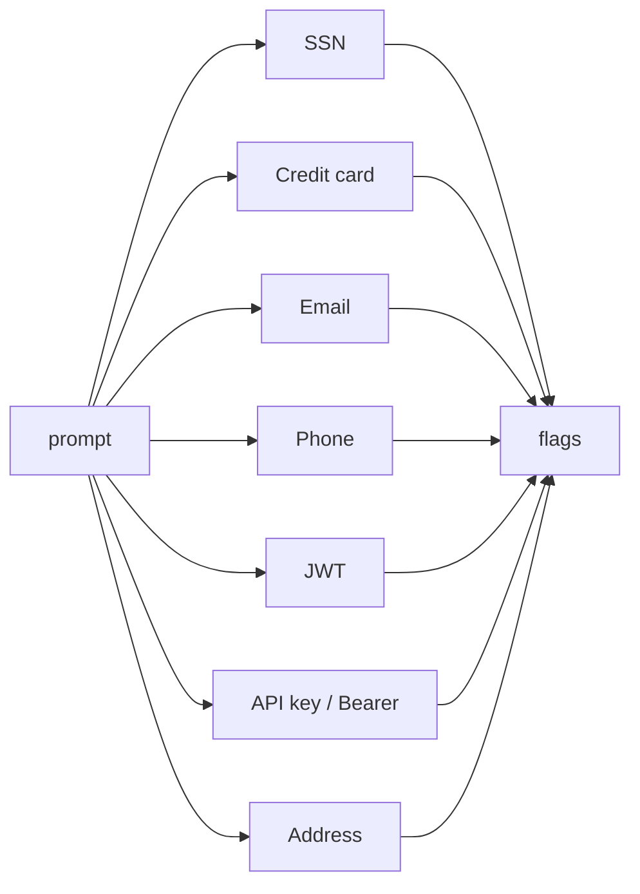
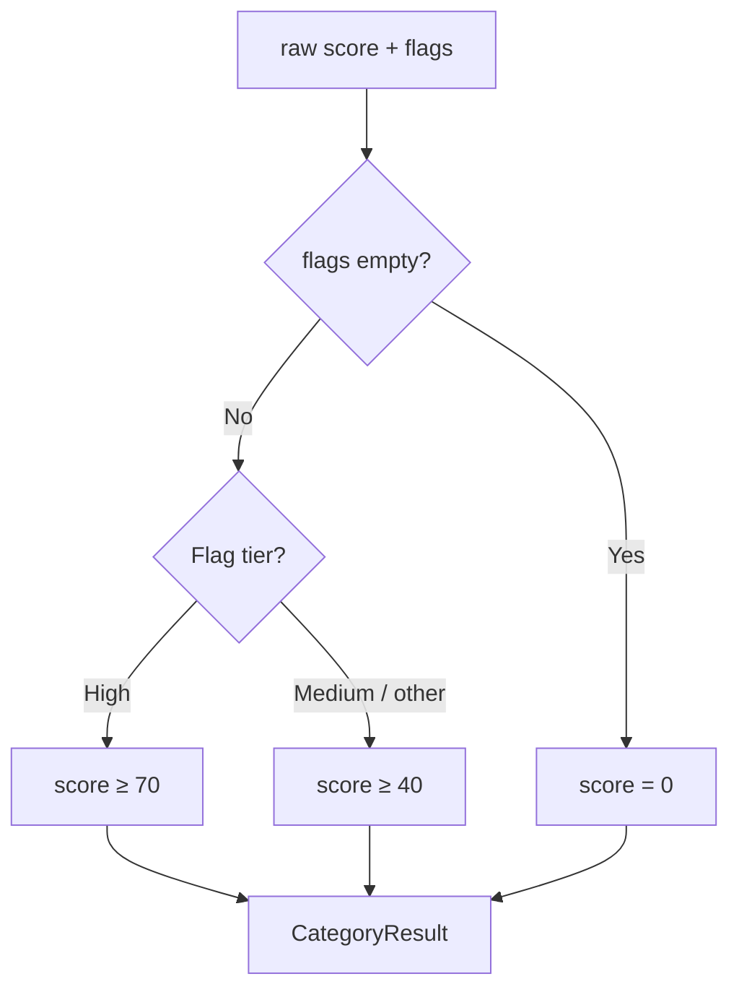

# Sensitive Information — Category Logic

Detects PII, credentials, and sensitive data via **deterministic regex/heuristics** plus **LLM classification**. Score is aligned so non-zero always corresponds to concrete detected data.

---

## Main flow: `check_sensitive`

---

## Heuristic detection: `_detect_sensitive_heuristic`

Runs regex/pattern checks; returns flags only (no content logged). Each pattern adds a single flag when matched.

| Flag | Pattern / trigger |
|------|-------------------|
| `ssn` | 9 digits, optional separators (123-45-6789) |
| `credit_card` | 13–19 digits, optional spaces/dashes |
| `email` | local@domain.tld |
| `phone_number` | (123) 456-7890, +1 123…, etc. (excludes SSN) |
| `jwt` | eyJ… .eyJ… . base64url segments |
| `api_key` | sk_/pk_, api_key=…, Bearer …, ghp_, xox- |
| `address` | Street number + street type, or US ZIP 5/9 digit |

Heuristic flags and LLM flags are **merged** (no duplicates); if either side finds something, it stays.

---

## Score adjustment: `_adjust_sensitive_score`

- **No flags** → score = **0** (no sensitive data).
- **Any flags** → score is at least **40**; raw score is clamped 0–100.
- **High-tier flags** → score = max(score, **70**).
- **Medium-tier flags** (or unmapped concrete flags) → score = max(score, **40**).

---

## High vs medium — what’s the distinction?

| Tier | Score | Distinction | Examples |
|------|--------|-------------|----------|
| **High** | ≥ 70 | **Credentials, secret identifiers, or financial IDs** — direct misuse risk (identity theft, account takeover, fraud). | SSN, passport, driver license, credit card, bank/IBAN/routing, CVV, **password**, **API key**, **JWT**, access/refresh token, private key, session cookie, recovery code |
| **Medium** | ≥ 40 | **Common PII / contact info** — can enable harassment or spam but not direct credential abuse. | Email, phone number, physical address, DOB, full name, account/customer ID |

**Rule of thumb:** High = “can log in or move money”; medium = “can contact or locate someone.”
