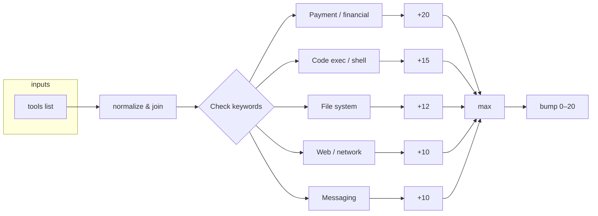

# Scoring Logic Chart


## Overview

The general score is computed from **category results** (sum of category scores) and optionally adjusted by **tool risk** (higher risk when dangerous tools are available). The result is **capped at 100** (minimum of summed score and 100).

---

## Main flow: `compute_general_score`

```mermaid
flowchart TD
    subgraph input["Input"]
        A[categories: Dict[str, CategoryResult]]
        B[tools: Optional list]
    end

    A --> C[Collect category scores]
    C --> D{Any scores?}
    D -->|No| E[base = 0]
    D -->|Yes| F[base = sum of category scores]

    E --> G{base == 0?}
    F --> G
    G -->|Yes| H[return 0]
    G -->|No| I[adjusted = base + tool_risk_bump(tools)]
    I --> J[return min(100, max(0, adjusted))]
```

**Rules:**
- **Base score** = sum of all category scores (0 if no categories).
- If base is 0 (all categories safe), the final score is **0** — tools do not add risk.
- Otherwise, add the tool risk bump; the result is **min(summed score, 100)** (clamped to 0–100).

---

## Tool risk bump: `_tool_risk_bump`

Tools are normalized (strip, lower), then joined. The bump is the **maximum** of the tiers that match.



### Bump tiers (highest wins)

| Bump | Category | Example keywords |
|------|----------|------------------|
| **+20** | Payment / financial | `payment`, `payments`, `charge`, `transfer`, `wire`, `crypto` |
| **+15** | Code exec / shell | `code_exec`, `exec`, `python`, `bash`, `shell`, `terminal`, `powershell` |
| **+12** | File system | `file_write`, `filesystem`, `write_file`, `delete_file`, `upload`, `download` |
| **+10** | Web / network | `web_search`, `browser`, `http`, `https`, `network`, `fetch`, `requests` |
| **+10** | Messaging | `email`, `sms`, `slack`, `discord`, `message`, `post`, `publish` |

If no tier matches, bump = **0**.

### High vs lower tiers — what’s the distinction?

| Bump | Risk level | Distinction | Why |
|------|------------|-------------|-----|
| **+20** | Highest | **Financial / money movement** — prompt + tools can spend or transfer value. | payment, charge, transfer, wire, crypto |
| **+15** | High | **Code execution / shell** — prompt can run arbitrary code or commands. | code_exec, exec, python, bash, shell, terminal, powershell |
| **+12** | Medium–high | **File system / persistence** — prompt can write, delete, or exfiltrate files. | file_write, filesystem, write_file, upload, download |
| **+10** | Medium | **Network or messaging** — prompt can reach the internet or send messages; no direct code or money. | web_search, browser, http, fetch; email, sms, slack, discord, post, publish |

**Rule of thumb:** Highest = can move money; then can run code; then can touch files; then can use network/messaging. Max of matching tiers is used.

---

## End-to-end flow

```mermaid
flowchart TD
    START[Category results + tools] --> BASE[base = sum(category scores)]
    BASE --> SAFE{base == 0?}
    SAFE -->|Yes| ZERO[Score = 0]
    SAFE -->|No| BUMP[Add tool_risk_bump]
    BUMP --> CAP[min(adjusted, 100)]
    CAP --> END[General score]
    ZERO --> END
```
